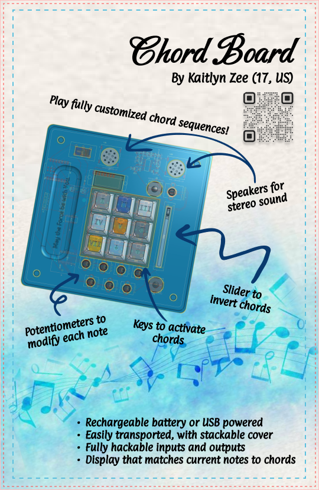
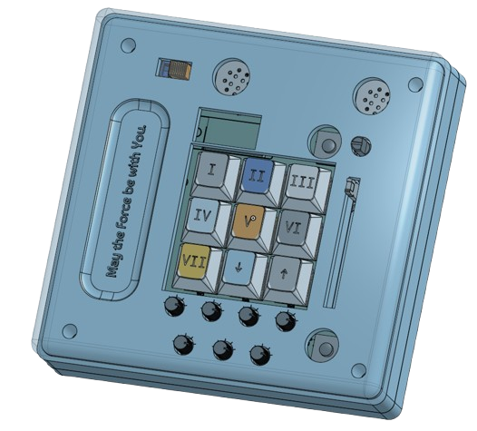
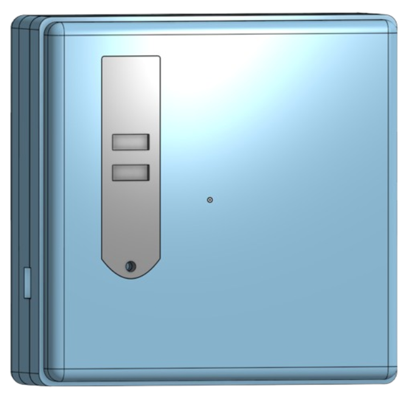
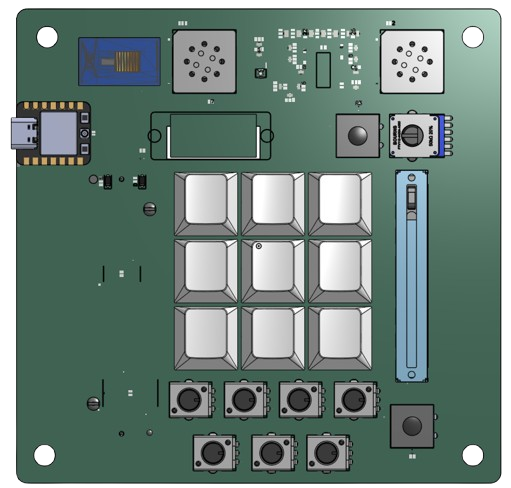
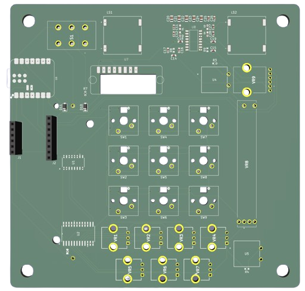
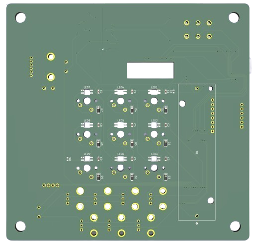
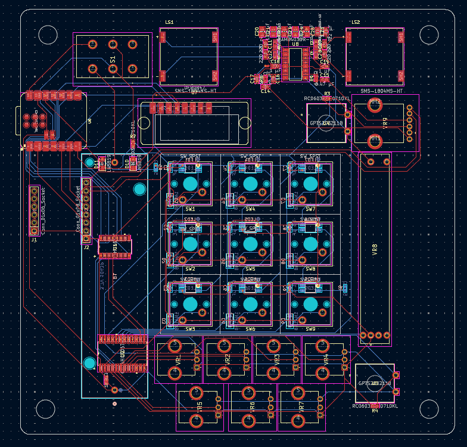

# Chord Board
The Chord Board is a MIDI controller, specifically designed for one to experiment with chords! 
Each note you play can be customized and looped.

I came up with this idea because I've always loved playing with different chords. 
I thought it would be cool to be able to experiment with them without having an actual instrument with me, 
or needing to learn the chords and fingerings to hear different combinations.

## Images

## Features
### Keypad
- 9 keys in a matrix
- 7 keys to activate chords
  - E.g. Pressing "I" will play the root chord, and "V" will play the fifth
- 2 keys to raise or lower the current key (default is C4)

### Rotary Potentiometers
- 7 knobs to modify chords
  - One knob for each note in the chord (1, 3, 5, 7, 9, 11, 13)
  - Each knob has 5 markings: ♭♭, ♭, no modification, #, ## (from left to right)
  - Modifications get applied to the next chord activated
  - If you don't want to include the note in the chord, just rotate the knob to any other position
  - E.g. If the 1st knob is not modified, the 2nd knob is at ♭, and the 3rd knob is not modified, a minor triad will play
- 1 logarithmic knob to adjust volume

### Slide potentiometer
- Inverts the chord depending on how much you slide
  - E.g. If a minor triad is playing and you slide 1/3 of the way, the base note will become the 5th

### Latching buttons
- 1 to cycle through different octaves, between octaves 2 to 6
- 1 to record a loop
  - When pressed, the chord sequence and timing will be recorded
  - When released, the chord sequence will be played back until you re-record or press another key

### TFT Display
- Displays the current key, including the octave, and the notes of the chord being played
  - If the notes being played are matched with a chord, that chord's name will be displayed as well

### Speakers
- Stereo sound
- Left and right speakers connected to a Class D Amplifier

### Power system
- 18650 3.7 V battery 
  - When a USB is plugged into the microcontroller, it will automatically charge
- Switch to power the board on/off
- A cover secures the battery, to be screwed open
  - Comes with a groove for fingers to easily remove the cover

### Stackable Case Cover
- The case comes with a cover, so the device can be transported without fear of accidentally pressing keys or rotating knobs
- The cover can be stacked on the bottom cover, so it doesn't have to lie around when the device is in use